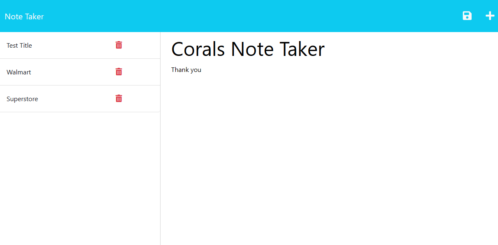

# Express-Note-Taker
Challenge 11 , Note Taker that can be used to write and save notes using express.js

## Description

I was tasked with my tenth challenge to make a Logo SVG Generator.

- learning to make back end work with front 
- learning to use new programs 
- learning to make async await work correctly
- learning to use heroku

**Note**: I followed the criteria below provided by the class instructors.

## User Story

- AS A small business owner
- I WANT to be able to write and save notes
- SO THAT I can organize my thoughts and keep track of tasks I need to complete

## Acceptance Criteria

- GIVEN a note-taking application
- WHEN I open the Note Taker
- THEN I am presented with a landing page with a link to a notes page
- WHEN I click on the link to the notes page
- THEN I am presented with a page with existing notes listed in the left-hand column, plus empty fields to enter a new - 
- note title and the note’s text in the right-hand column
- WHEN I enter a new note title and the note’s text
- THEN a Save icon appears in the navigation at the top of the page
- WHEN I click on the Save icon
- THEN the new note I have entered is saved and appears in the left-hand column with the other existing notes
- WHEN I click on an existing note in the list in the left-hand column
- THEN that note appears in the right-hand column
- WHEN I click on the Write icon in the navigation at the top of the page
- THEN I am presented with empty fields to enter a new note title and the note’s text in the right-hand column

 **Note**: Heroku deployment keeps crashing when i toggle off payments 

## Mock-Up

The following image shows the web application after I edited the code.

**Note**: This image is a screen shot once I finished the assisnment.

## Credits
 - [W3 School](https://www.w3schools.com/js/js_async.asp)
 - [Youtube](https://www.youtube.com/watch?v=39znK--Yo1o&list=PL_cUvD4qzbkwp6pxx27pqgohrsP8v1Wj2)
 - [MDN](https://developer.mozilla.org/en-US/docs/Learn/Server-side/Express_Nodejs/Tutorial_local_library_website)
 - study group help

**Note**: User story and acceptance criteria was provided to me in class
 UNB-VIRT-FSF-PT-04-2023-U-LOLC for Week 11 Challenge. 

## My Github & Deployed Heroku 

- [Github](https://xnoirnightx.github.io/Express-Note-Taker)
- [Heroku](https://evening-plateau-00491-158fec99f675.herokuapp.com/notes)

## License

